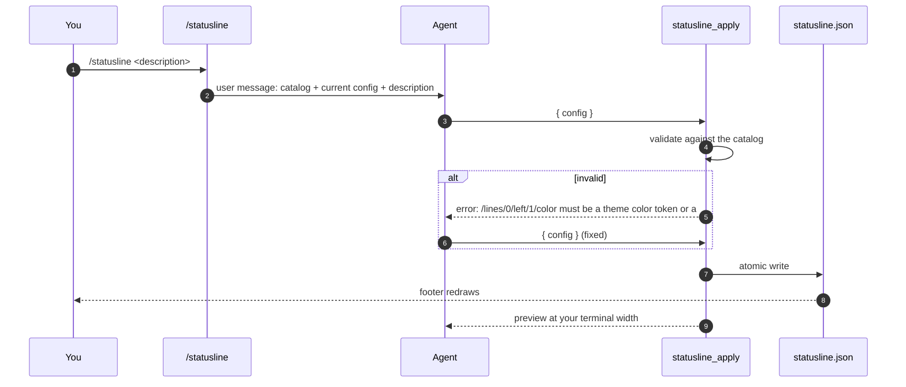
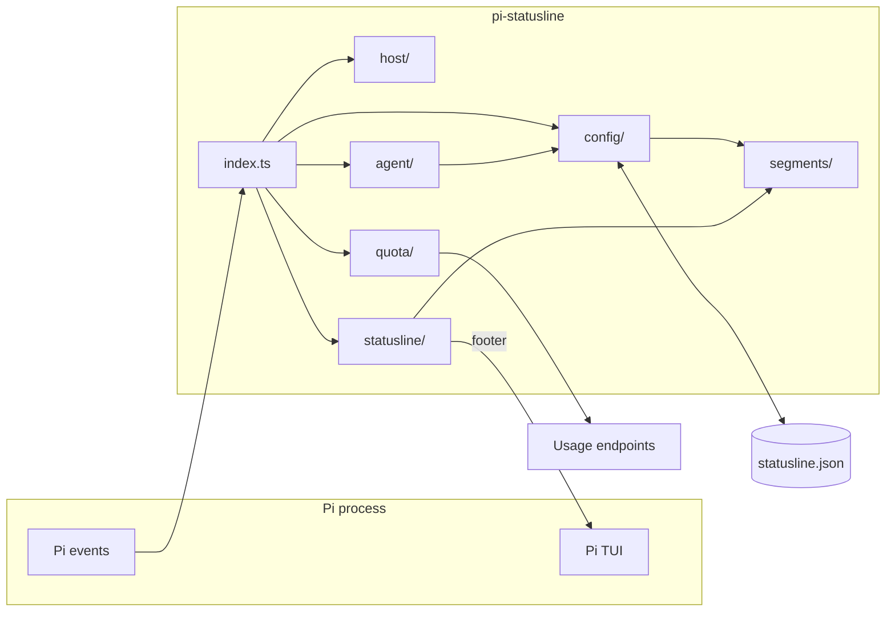
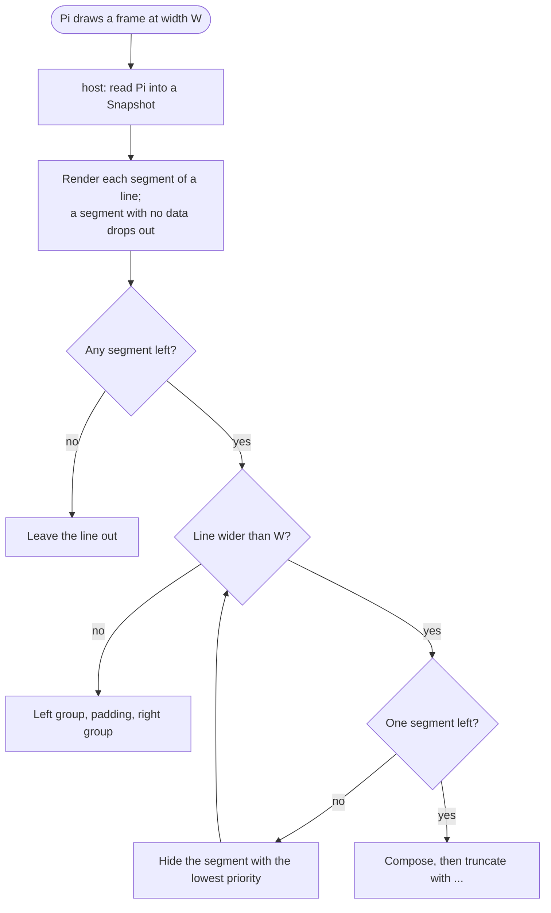

```text
 ⠀⠀⠀⠀⠀⠀⠀⠀⠀⠀⠀⠀⠀⠀⠀⠀⠀⠀⠀⠀⠀⠀⠀⠀⠀⠀⠀⠀⠀⠀⠀⠀⠀⠀⢀⣀⣤⡴⡶⣾⡿⠃
 ⠀⠀⠀⠀⠀⠀⠀⠀⠀⠀⠀⠀⠀⠀⠀⠀⠀⠀⠀⠀⠀⠀⠀⠀⠀⠀⠀⠀⠀⢀⣤⡴⡶⡻⡻⣯⣪⣪⣮⡾⠃
 ⠀⠀⠀⠀⠀⠀⠀⠀⠀⠀⠀⠀⠀⠀⠀⠀⠀⠀⠀⠀⠀⠀⠀⠀⠀⠀⠀⢀⣼⣿⢻⢸⠸⣘⣬⡿⣿⣗⣿⠁
 ⠀⠀⠀⠀⠀⠀⠀⠀⠀⠀⠀⠀⠀⠀⠀⠀⠀⠀⠀⠀⠀⠀⠀⠀⠀⠀⣠⡿⣱⣯⣮⡾⣟⡯⡷⡯⣯⢿⠃⠀⠀⠀⠀⠀⠀⠀⠀⠀⠀⠀⠀⠀⠀⠀⠀⠀⠀⠀⠀⠀⠀⠀⠀⠀⠀⠀⠀⠀⠀⠀⠀⠀⠀⠀⠀⠀⠀⠀⠀⠀⠀⠀⠀⠀⣀⡀
 ⠀⠀⠀⠀⠀⠀⠀⠀⠀⠀⠀⠀⠀⠀⠀⠀⠀⠀⠀⠀⠀⠀⠀⠀⠀⣰⣿⣮⣿⣟⢾⣝⣗⡯⣿⣝⣷⡿⠀⠀⠀⠀⠀⠀⠀⠀⠀⠀⠀⠀⠀⠀⠀⠀⠀⠀⠀⠀⠀⠀⠀⠀⠀⠀⠀⠀⠀⠀⠀⠀⠀⠀⠀⠀⠀⠀⠀⠀⠀⠀⠀⣠⣴⢟⢿⡇
 ⠀⠀⠀⠀⠀⠀⠀⠀⠀⠀⠀⠀⠀⠀⠀⠀⠀⠀⠀⠀⠀⣀⣀⣤⣤⣿⣽⣿⣷⣯⣷⣷⣿⣿⣿⢿⣬⣀⠀⠀⠀⠀⠀⠀⠀⠀⠀⠀⠀⠀⠀⠀⠀⠀⠀⠀⠀⠀⠀⠀⠀⠀⠀⠀⠀⠀⠀⠀⠀⠀⠀⠀⣀⡀⣀⣠⣤⣤⣶⡶⢟⢫⢪⣪⣾⠇
 ⠀⠀⠀⠀⠀⠀⠀⠀⠀⠀⠀⠀⠀⠀⠀⠀⠀⢴⣾⣟⣻⣹⣹⣘⣌⣎⣝⣝⣭⣝⣼⣩⢫⠫⣛⢛⢻⢻⣳⣦⣀⠀⠀⠀⠀⠀⠀⠀⠀⠀⠀⠀⠀⠀⠀⠀⠀⠀⠀⠀⠀⠀⠀⢀⠀⠀⠀⠀⠀⠀⣰⣾⣿⣿⣿⣷⣾⣯⣷⣾⣿⣿⣿⣽⡿⣷⢶⣄
 ⠀⠀⠀⠀⠀⠀⠀⠀⠀⠀⠀⠀⠀⠀⠀⠀⠀⠀⠀⠀⠈⠈⠈⠉⢹⣽⣿⣿⢿⢿⣻⢿⣵⣧⡷⡟⣛⢏⢝⠝⡝⠷⣦⣄⠀⠀⠀⠀⠀⠀⠀⠀⠀⠀⠀⠀⠀⢀⣠⣴⣶⣶⣿⣿⣿⣶⣶⣶⣶⣿⣿⣷⣗⣝⣿⢿⣻⣹⣽⣷⣭⡓⡝⡓⡟⡟⣿⣾⣳⡀
 ⠀⠀⠀⠀⠀⠀⠀⠀⠀⠀⠀⠀⠀⠀⠀⠀⠀⠀⠀⠀⠀⠀⠀⠀⢺⣯⣿⢯⡯⣟⡾⣽⢽⣻⣿⣷⣕⣅⢇⠇⣇⣇⣧⣮⣿⣦⣀⠀⠀⠀⠀⠀⠀⢀⣴⣿⣿⡿⣳⣿⣟⣿⣾⣿⣽⣿⣿⣿⣷⣿⣿⣿⣿⣝⣿⣿⢿⢽⣺⣽⣿⣷⡱⡱⡑⡕⠽⣿⣻⡇
 ⠀⠀⠀⠀⠀⠀⠀⠀⠀⠀⠀⠀⠀⠀⠀⠀⠀⠀⠀⠀⠀⠀⠀⠀⠸⣧⣿⣻⣺⣳⢯⣷⣿⣟⣯⡏⠙⠾⣵⣿⢫⢹⢰⢸⢰⢑⢝⢛⢦⣄⠀⠀⠠⣾⣿⣿⢿⣽⣿⣾⣻⢿⣿⣿⣿⣿⣹⣿⣿⣿⣻⣿⣯⣿⣿⣾⣯⣿⣽⣿⣗⣿⣷⣕⢵⠱⠝⢻⣽⡇
 ⠀⠀⠀⠀⠀⠀⠀⠀⠀⠀⠀⠀⠀⠀⠀⠀⠀⠀⠀⠀⠀⠀⠀⠀⠀⠻⢷⣭⣷⣯⣟⣯⣗⣗⣿⡇⠀⠀⠈⠙⢿⣞⣜⣬⣮⣮⣾⣿⣿⣿⣿⢶⣤⣼⢿⢱⢪⢪⢪⣪⡝⡝⣗⣯⣯⣯⣯⣯⣯⣿⢯⢯⣿⣾⣿⢟⢟⡿⣿⣻⣺⣾⢿⣧⠀⣠⢺⢸⡿
 ⠀⠀⠀⠀⠀⠀⠀⠀⠀⠀⠀⠀⠀⠀⠀⠀⠀⠀⠀⠀⠀⠀⠀⠀⠀⠀⠀⠀⠀⠀⠈⠈⠉⠉⠉⠁⠀⠀⠀⠀⠀⠈⠛⣯⡲⣸⣿⣿⣿⢿⢟⢟⢝⢪⢱⢱⣱⣵⡿⡣⡣⣱⣾⣿⡿⡣⠣⡍⡽⣯⡯⣯⣿⢿⢯⢳⢕⣿⣷⡿⡻⡝⣿⣿⡮⣣⣣⣿⢷⣄⡀
 ⠀⠀⠀⠀⠀⠀⠀⠀⠀⠀⠀⠀⠀⠀⠀⠀⠀⠀⠀⠀⠀⠀⠀⠀⠀⠀⠀⠀⠀⠀⠀⠀⠀⠀⠀⠀⠀⠀⠀⣀⣠⣤⡾⡿⡻⡫⡫⡪⡪⡊⡆⢧⣧⣧⣷⢟⣷⣯⣪⡢⣣⣾⣿⣿⣕⢪⢱⢱⠸⣽⣯⣷⣟⣿⣮⣷⣟⣿⣧⣷⡽⣮⣾⣯⣿⢯⣿⣟⣾⣺⣿
 ⠀⠀⠀⠀⠀⠀⠀⠀⠀⠀⠀⠀⠀⠀⠀⠀⠀⠀⠀⠀⠀⠀⠀⠀⠀⠀⠀⠀⠀⠀⠀⠀⢀⣀⣤⣴⢶⢾⢻⢫⢫⢪⢪⠪⡪⣊⣎⣼⣴⢷⣟⣿⣿⣿⣿⣿⡟⡯⣿⣿⣿⣿⣿⣿⣷⣷⣷⣷⣿⣿⣿⣿⣻⢿⣿⣽⣾⢿⣿⣽⣿⣿⣾⣯⣿⣿⣿⣿⣿⣿⠟
 ⠀⠀⠀⠀⠀⠀⠀⠀⠀⠀⠀⠀⠀⠀⠀⠀⠀⠀⠀⠀⠀⠀⠀⠀⠀⠀⣀⣠⣤⡶⡶⡟⡟⡫⡣⡣⣣⣣⣣⣵⣵⣷⣞⣿⢽⢯⠿⠾⡞⡟⡾⢾⣿⣿⣿⢟⢕⢕⢕⢝⢻⢽⣿⣿⣿⣿⣿⡿⠋⢛⣛⣿⣿⣿⣿⣿⣿⣿⣿⣿⣿⠿⠿⠛⠋⠁⠀⠈⠉
 ⠀⠀⠀⠀⠀⠀⠀⠀⠀⠀⠀⠀⠀⠀⠀⠀⠀⠀⠀⠀⠀⢀⣤⣶⣞⣟⣏⣫⣢⣣⣣⣕⣷⣿⣿⣽⣽⣽⣽⣷⣷⣶⣷⣾⣻⣻⣿⣿⣿⣿⣿⣷⣾⣾⣢⣣⣣⣵⣼⡞⡟⣛⠻⢿⣯⡉⠁⠀⠀⠈⠙⠻⠿⣿⣽⢯⣟⡯⣟⡟
 ⠀⠀⠀⠀⠀⠀⠀⠀⠀⠀⠀⠀⠀⠀⠀⠀⠀⠀⠀⠀⠀⠉⠉⠉⠉⠉⠙⠙⠙⠉⠉⠉⠉⠉⠉⠉⠉⠉⢉⣩⣿⡿⣟⣿⣻⣿⣻⣻⣻⣿⣟⣿⣿⣻⣻⢿⣵⣣⡪⡪⡸⡰⡹⡘⡜⡻⣶⣄⠀⠀⠀⠀⠀⠀⠉⠙⠳⢿⠟
 ⠀⠀⠀⠀⠀⠀⠀⠀⠀⠀⠀⠀⠀⠀⠀⠀⠀⠀⠀⠀⠀⠀⠀⠀⠀⠀⠀⠀⠀⠀⠀⠀⠀⣀⣠⣴⣶⣿⣿⢿⣽⣽⡿⣯⣷⣷⣿⣞⣗⣿⣳⣻⣷⣳⢯⢯⣟⣿⣞⣜⢌⢎⢆⢇⣇⣧⢷⢻⢳⣤⠀⠀⠀⠀⠀⠀⠀⠀⠀⠀⠀⠀⠀⣠⣴⣿⡇
 ⠀⠀⠀⠀⠀⠀⠀⠀⠀⠀⠀⠀⠀⠀⠀⠀⠀⠀⠀⠀⠀⠀⠀⠀⠀⠀⢀⣀⣤⣴⢶⣟⡿⡟⣟⢯⣫⣮⣮⣾⣶⣷⢟⣿⣻⣿⣟⣿⣽⣿⣾⣟⣿⢿⣻⣽⡾⠃⠈⠳⣯⣮⢾⢋⢇⠇⡇⡣⡣⡹⢻⢦⣀⠀⠀⠀⠀⠀⠀⠀⢀⣴⢾⢫⢪⢻⡃
 ⠀⠀⠀⠀⠀⠀⠀⠀⠀⠀⠀⠀⠀⠀⠀⠀⠀⠀⠀⠀⢀⣀⣤⣴⣶⡿⣟⠿⣝⣞⣽⣼⣾⡽⠿⠛⠛⠉⠉⠁⠀⠙⠿⣿⣿⣿⡿⠋⠙⠻⠾⠿⡾⠿⠞⠋⠀⠀⠀⠀⠀⠙⢯⣮⢪⠪⡪⢪⢊⢎⠎⡎⡝⢷⣄⠀⠀⠀⣠⡶⡟⡕⢕⢅⢇⣿
 ⠀⠀⠀⠀⠀⠀⠀⠀⠀⠀⠀⠀⠀⠀⢀⣀⣤⣴⣶⡿⡿⣛⣏⣯⣮⣾⡾⠿⠛⠋⠉⠁⠀⠀⠀⠀⠀⠀⠀⠀⠀⠀⠀⠀⠉⠁⠀⠀⠀⠀⠀⠀⠀⠀⠀⠀⠀⠀⠀⠀⠀⠀⠀⠙⢯⣗⢕⢕⢕⢱⣱⡵⡟⡏⡝⡝⣦⣾⣿⡎⢎⣎⢎⣪⣾⡏
 ⠀⠀⠀⠀⠀⠀⠀⠀⢀⣀⣤⣴⣶⡿⡿⣻⣫⣯⣾⠾⠿⠛⠋⠉⠁⠀⠀⠀⠀⠀⠀⠀⠀⠀⠀⠀⠀⠀⠀⠀⠀⠀⠀⠀⠀⠀⠀⠀⠀⠀⠀⠀⠀⠀⠀⠀⠀⠀⠀⠀⠀⠀⠀⠀⠀⠉⢻⣵⡷⡻⡱⡑⡕⡜⡜⢼⡟⣿⡹⡨⡝⣏⣮⣟⣾⠃
 ⠀⠀⣀⣠⣤⣶⣶⢿⢿⣻⣯⣿⠾⠾⠛⠛⠉⠁⠀⠀⠀⠀⠀⠀⠀⠀⠀⠀⠀⠀⠀⠀⠀⠀⠀⠀⠀⠀⠀⠀⠀⠀⠀⠀⠀⠀⠀⠀⠀⠀⠀⠀⠀⠀⠀⠀⠀⠀⠀⠀⠀⠀⠀⠀⠀⠀⠀⠈⠳⣷⣕⢕⢕⢱⢸⣟⢕⡿⡪⣪⣾⢽⣞⣾⠏
 ⣶⣿⣫⣯⣯⡾⠾⠛⠛⠉⠁⠀⠀⠀⠀⠀⠀⠀⠀⠀⠀⠀⠀⠀⠀⠀⠀⠀⠀⠀⠀⠀⠀⠀⠀⠀⠀⠀⠀⠀⠀⠀⠀⠀⠀⠀⠀⠀⠀⠀⠀⠀⠀⠀⠀⠀⠀⠀⠀⠀⠀⠀⠀⠀⠀⠀⠀⠀⠀⠈⠳⣝⣎⢎⣿⣿⣼⣿⣻⣻⣺⣽⣾⡏
 ⠉⠋⠉⠁⠀⠀⠀⠀⠀⠀⠀⠀⠀⠀⠀⠀⠀⠀⠀⠀⠀⠀⠀⠀⠀⠀⠀⠀⠀⠀⠀⠀⠀⠀⠀⠀⠀⠀⠀⠀⠀⠀⠀⠀⠀⠀⠀⠀⠀⠀⠀⠀⠀⠀⠀⠀⠀⠀⠀⠀⠀⠀⠀⠀⠀⠀⠀⠀⠀⠀⠀⠈⣿⢻⣯⣙⣿⣗⣷⣿⣿⣿⠟⠁
 A statusline of segments for Pi, designed by the agent.⠀⠀⠀⠀⠀⠀⠀⠀⠀⠀⠀⠀⠀⠀⠀⣠⣾⢣⢣⢹⣻⣿⢿⣿⣿⣿⡷
 ⠀⠀⠀⠀⠀⠀⠀⠀⠀⠀⠀⠀⠀⠀⠀⠀⠀⠀⠀⠀⠀⠀⠀⠀⠀⠀⠀⠀⠀⠀⠀⠀⠀⠀⠀⠀⠀⠀⠀⠀⠀⠀⠀⠀⠀⠀⠀⠀⠀⠀⠀⠀⠀⠀⠀⠀⠀⠀⠀⠀⠀⠀⠀⠀⠀⠀⠀⠀⣠⡾⡟⢕⣱⣵⡿⣯⣷⣿⣿⢿⡟⠁
 ⚠ Status: 0.1.0. Pins Pi 1.0.1.⠀⠀⠀⠀⠀⠀⠀⠀⠀⠀⠀⠀⠀⠀⠀⠀⠀⠀⠀⠀⠀⠀⠀⠀⠀⠀⠀⠀⠀⠀⠀⠀⠀⠀⠀⣠⢾⢫⣣⣷⣿⣿⢷⣿⣟⡯⣗⡿⠋
 ⠀⠀⠀⠀⠀⠀⠀⠀⠀⠀⠀⠀⠀⠀⠀⠀⠀⠀⠀⠀⠀⠀⠀⠀⠀⠀⠀⠀⠀⠀⠀⠀⠀⠀⠀⠀⠀⠀⠀⠀⠀⠀⠀⠀⠀⠀⠀⠀⠀⠀⠀⠀⠀⠀⠀⠀⠀⠀⠀⠀⠀⠀⠀⠀⢠⡾⣩⣷⣿⠿⡿⣩⣿⣟⣷⠷⠟⠋
 ⠀⠀⠀⠀⠀⠀⠀⠀⠀⠀⠀⠀⠀⠀⠀⠀⠀⠀⠀⠀⠀⠀⠀⠀⠀⠀⠀⠀⠀⠀⠀⠀⠀⠀⠀⠀⠀⠀⠀⠀⠀⠀⠀⠀⠀⠀⠀⠀⠀⠀⠀⠀⠀⠀⠀⠀⠀⠀⠀⠀⠀⠀⠀⢰⣿⡿⠟⠋⠁⠘⠛⠛⠉⠁
 ⠀
 pi install git:github.com/josemartinrodriguezmortaloni/pi-statusline
```

pi-statusline is a [Pi](https://github.com/earendil-works/pi) extension that replaces the Pi footer with a statusline of segments. A JSON config declares the lines, the left and the right group of each line, and the order, the priority and the color of each segment. You can write the config yourself, or describe the statusline in one sentence and let the agent write it.

Without a config, a preset reproduces the default Pi footer and adds the session time.

## Highlights

- **The agent designs it:** `/statusline <description>` sends the agent the segment catalog and your current config; the agent writes only through a tool that validates the config and shows a preview at your terminal width
- **One catalog:** each segment declares its options once; the config schema, the agent prompt and the render come from that declaration
- **Hot reload:** save `statusline.json` and the footer redraws; an invalid edit keeps the last valid config and names the failing field
- **Fits any width:** when a line is too wide, segments hide by ascending priority; a line that still does not fit truncates with `...`
- **Subscription quota:** the 5 h, 7 d and extra windows of your Claude, Claude Code and Codex logins, polled every 60 s, with a back-off on HTTP 429
- **Live clocks:** the session and turn timers redraw every second, and only while the config shows them
- **Pi's footer on demand:** `/statusline off` restores the default Pi footer, and new sessions keep it off
- **Credentials stay local:** the extension reads the logins that Pi and the CLIs already keep, and sends them only to the usage endpoint of their provider

<p>
  <a href="https://github.com/earendil-works/pi"></a>
  <a href="https://www.typescriptlang.org"></a>
  <a href="https://biomejs.dev"></a>
  <a href="https://github.com/josemartinrodriguezmortaloni/pi-statusline/commits/main"></a>
</p>

## Install

You need **Pi 1.0.1** (`pi --version`).

```bash
pi install git:github.com/josemartinrodriguezmortaloni/pi-statusline
```

Pi clones the repo and installs its dependencies. To install from a clone:

```bash
git clone https://github.com/josemartinrodriguezmortaloni/pi-statusline.git
cd pi-statusline
bun install
pi install "$PWD"
```

To try the extension for one session without installing it, run `pi -e ./src/index.ts` from the clone.

## Get started

Start a new Pi session. The footer shows the preset: the default Pi footer, plus the session time on the right of the first line.

```text
~/Work/pi-statusline (main) • readme                                                  ⏱ 1h2m
↑12k ↓3.4k R120k W8.1k CH92.3% $0.000 (sub) 31.2%/200k (auto)       (claude-acp) opus • high
engram ✓ MCP 2/2
```

On a narrow terminal, the segments with the lowest priority hide first. At 56 columns the same preset drops the cache, the cost and the thinking level:

```text
~/Work/pi-statusline (main) • readme              ⏱ 1h2m
↑12k ↓3.4k 31.2%/200k (auto)           (claude-acp) opus
engram ✓ MCP 2/2
```

### Design the statusline with the agent

```text
/statusline <description>
```

For example:

```text
/statusline path and branch on the left, model on the right; below, the 5h quota of Claude Code and the turn time
```

The command sends the agent a request built from the segment catalog: every segment, its options, the color tokens of the theme, your current config and your description. The agent writes the config only through the `statusline_apply` tool. The tool validates the config, writes it and returns a plain-text preview at your terminal width. An invalid config is not written: the tool fails with the path of each failing field, and the agent tries again. If the agent is busy, the request waits as a follow-up message.



### Commands

| Command                     | Effect                                                                               |
| --------------------------- | ------------------------------------------------------------------------------------ |
| `/statusline <description>` | Asks the agent to design the statusline.                                             |
| `/statusline on`            | Shows the statusline and saves `enabled: true`.                                      |
| `/statusline off`           | Restores the default Pi footer and saves `enabled: false`. New sessions keep it off. |
| `/statusline reset`         | Replaces the config with the preset.                                                 |
| `/statusline`               | Shows the usage.                                                                     |

`on` and `off` keep the rest of the config, so they refuse to run while `statusline.json` is invalid: they would replace your edit with the last valid config. Fix the file, or run `/statusline reset`.

## Configuration

The config is global: `~/.pi/agent/statusline.json`. Pi applies a saved edit at once, without a restart.

```json
{
  "enabled": true,
  "lines": [
    {
      "left": [
        { "segment": "cwd", "color": "accent", "priority": 10 },
        { "segment": "git-branch", "color": "dim" }
      ],
      "right": [{ "segment": "model", "color": "#7aa2f7", "priority": 9 }]
    },
    {
      "left": [
        { "segment": "usage", "window": "5h", "thresholds": { "warning": 80 } },
        { "segment": "context", "bar": true }
      ],
      "right": [{ "segment": "turn-time" }]
    },
    {
      "left": [
        { "segment": "status", "key": "mcp" },
        { "segment": "statuses", "exclude": ["engram"] }
      ],
      "right": [{ "segment": "session-time" }]
    }
  ]
}
```

At 84 columns, during a turn:

```text
~/Work/pi-statusline (main)                                        (claude-acp) opus
5h ●●●○○○○○ 38% ⟳ 05:40 PM ●●○○○○○○ 31.2% · 62k used · 138k left (auto)        ▶ 45s
MCP 2/2                                                                       ⏱ 1h2m
```

Every segment accepts two options besides its own:

| Option     | Effect                                                                                                                                                                                    |
| ---------- | ----------------------------------------------------------------------------------------------------------------------------------------------------------------------------------------- |
| `priority` | When a line does not fit, segments hide by ascending priority. Between equal priorities, the segment later in the line hides first. The last segment of a line always stays. Default `0`. |
| `color`    | A foreground token of the active Pi theme, such as `accent`, `dim` or `success`, or a `#rrggbb` hex. Without it, the text keeps the terminal color.                                       |

- The left group starts at the left edge. The right group ends at the right edge, at least 2 columns after the left group.
- A segment with no data hides itself. A line with no visible segment is left out.
- A segment can override its color with a warning or an error tone: `context` above 70 % and 90 %, and `usage` at its `thresholds`.

### Segments

| Segment        | Options                                                               | Shows                                                                                                                         | Example                                                      |
| -------------- | --------------------------------------------------------------------- | ----------------------------------------------------------------------------------------------------------------------------- | ------------------------------------------------------------ |
| `cwd`          |                                                                       | Working directory, with the home directory as `~`.                                                                            | `~/Work/pi-statusline`                                       |
| `git-branch`   |                                                                       | Current branch. Hidden outside a git repository.                                                                              | `(main)`                                                     |
| `session-name` |                                                                       | Session name. Hidden when the session has no name.                                                                            | `• readme`                                                   |
| `tokens`       |                                                                       | Session input and output tokens.                                                                                              | `↑12k ↓3.4k`                                                 |
| `cache`        |                                                                       | Prompt cache reads, writes, and the hit rate of the latest response.                                                          | `R120k W8.1k CH92.3%`                                        |
| `cost`         |                                                                       | Session cost; `(sub)` when the provider bills through a subscription.                                                         | `$0.412`, `$0.000 (sub)`                                     |
| `context`      | `bar` (`false`)                                                       | Used share of the context window; `(auto)` when auto-compaction is on. `bar` adds a bar, the used tokens and the tokens left. | `31.2%/200k (auto)`, `●●○○○○○○ 31.2% · 62k used · 138k left` |
| `model`        |                                                                       | Provider and model id.                                                                                                        | `(claude-acp) opus`                                          |
| `thinking`     |                                                                       | Thinking level. Hidden when the model does not reason.                                                                        | `• high`                                                     |
| `session-time` |                                                                       | Time since the session started.                                                                                               | `⏱ 1h2m`                                                     |
| `turn-time`    |                                                                       | Duration of the agent turn in progress, or of the last turn.                                                                  | `▶ 45s`, `■ 2m`                                              |
| `status`       | `key`                                                                 | The status of one extension, by its status key.                                                                               | `MCP 2/2`                                                    |
| `statuses`     | `exclude` (`[]`)                                                      | The statuses of the other extensions, sorted by key, except the keys that `status` segments show and the keys in `exclude`.   | `engram ✓ MCP 2/2`                                           |
| `usage`        | `provider` (`"active"`), `window` (`"5h"`), `thresholds` (`50`, `90`) | Subscription quota of one window: a bar, the used percent and the reset time, or the extra credits spent.                     | `5h ●●●○○○○○ 38% ⟳ 05:40 PM`, `extra ●○○○○○○○ $4.20/$50.00`  |

### Quota

`usage` reads the quota of the provider of the active model (`"provider": "active"`), or of a fixed provider. `window` is `5h`, `7d` or `extra`. The segment turns to warning at 50 % and to error at 90 %, unless `thresholds` says otherwise. Reset times follow the system locale.

| Provider       | Credential                                                       |
| -------------- | ---------------------------------------------------------------- |
| `claude-acp`   | `~/.claude/.credentials.json`, the login of the `claude` binary. |
| `anthropic`    | The Pi login. An API key has no quota, so the segment hides.     |
| `openai-codex` | The Pi login, or `~/.codex/auth.json` when Pi has none.          |

The extension polls only the providers that the config shows now, every 60 s. When you switch models, a segment that follows the active provider starts to poll the new one at once.

| Response                                | Effect                                                                                                        |
| --------------------------------------- | ------------------------------------------------------------------------------------------------------------- |
| `200`                                   | The segment shows the new windows.                                                                            |
| `401`, `403`                            | The credential expired or was revoked: the segment hides.                                                     |
| `429`                                   | The provider is not asked again for the time in `Retry-After`: 5 min without the header, never more than 1 h. |
| Any other failure, or no answer in 10 s | The segment keeps the last windows.                                                                           |

## How it works

The extension mounts a footer component through `ctx.ui.setFooter`. Each time Pi draws a frame, the footer reads Pi into a `Snapshot` of plain data and renders the config against it. The render is pure: it does no I/O, so a test or the `statusline_apply` preview renders the same lines as the footer.



### A frame



The footer redraws when Pi draws, when the git branch changes, when the config reloads, and when new quota arrives. While the config shows `session-time` or `turn-time`, it also redraws every second.

Token totals scan every entry of the session, and the footer renders on every frame. Entries only append, and each append moves the leaf, so the host caches the totals by session id and leaf id.

### The config file

- A missing file means the preset. An invalid file at session start means the preset and a warning with the failing paths.
- The store watches the directory, not the file, because an atomic write replaces the file. Events that arrive within 50 ms reload once.
- An invalid edit keeps the last valid config and notifies the JSON pointer of each failing field, such as `/lines/0/left/1/color`.
- Writes go to a temporary file in the same directory, then rename over the config, so a reader never sees half a file.
- A symlinked config stays a symlink: the store reads, watches and writes the target.
- Without a watcher, for example at the inotify limit, the statusline still works; only hot reload stops.

## Architecture

Each folder of `src/` is a deep module: other code reaches it only through its `index.ts`. `index.ts` at the root only wires Pi events to the modules. dependency-cruiser enforces both rules and keeps the graph one-way.

| Module        | Owns                                                                                                              | Changes when                                    |
| ------------- | ----------------------------------------------------------------------------------------------------------------- | ----------------------------------------------- |
| `index.ts`    | Pi events → modules: session start and end, model select, agent start and end                                     | Pi's extension events change                    |
| `host/`       | Pi → `Snapshot`: working directory, tokens, context, model, timestamps, turn clock                                | Pi's context API changes                        |
| `segments/`   | The catalog: id, summary, options and render of each segment, and the formats                                     | A segment is added or changes                   |
| `statusline/` | Layout by priority, paint, the footer component and the plain-text preview                                        | The layout rules or Pi's footer contract change |
| `config/`     | The schema derived from the catalog, the preset, and the store that reads, validates, writes and watches the file | The config format changes                       |
| `quota/`      | The quota monitor, and one adapter per provider family                                                            | A provider's usage endpoint changes             |
| `agent/`      | `/statusline`, the design prompt and the `statusline_apply` tool                                                  | How the agent designs the statusline changes    |

To add a segment, add one `defineSegment` to `segments/` and list it in `CATALOG`. The schema, the agent prompt and the render pick it up. To add a quota provider, add one adapter to `quota/` and list it in `createAdapters`.

## Limits

- The config is global. A project cannot have its own statusline.
- Quota covers `anthropic`, `claude-acp` and `openai-codex`. Other providers show no `usage`.
- The quota endpoints are the ones that the Claude Code and Codex clients use, not documented APIs. If a response changes shape, the segment hides until a new release.
- Quota is up to 60 s old.
- `git-branch` and `statuses` come from Pi's footer data, so the `statusline_apply` preview shows them only after the footer has drawn once.
- The Pi version is pinned. A new Pi API needs a new release of this extension.

## Development

```bash
bun install          # also points git at .githooks/
pi -e ./src/index.ts # load the working tree in Pi
```

| Command              | Checks                                                                                               |
| -------------------- | ---------------------------------------------------------------------------------------------------- |
| `bun run typecheck`  | `tsc --noEmit`, strict                                                                               |
| `bun run lint`       | Biome                                                                                                |
| `bun run complexity` | ESLint, cyclomatic complexity < 4 per function                                                       |
| `bun run deps`       | dependency-cruiser: deep modules and the one-way graph                                               |
| `bun run test`       | vitest through the extension entry, with the network, the home directory and the clock injected      |
| `bun run smoke`      | The real quota endpoints, with the logins of this machine. Each case skips when its login is missing |

`pre-commit` runs typecheck, lint and complexity. `pre-push` runs typecheck and tests. The smoke test never runs in a hook.

## Credits

Built on [Pi](https://github.com/earendil-works/pi) by Earendil. The header is the Swordfish II from _Cowboy Bebop_, drawn in braille.
